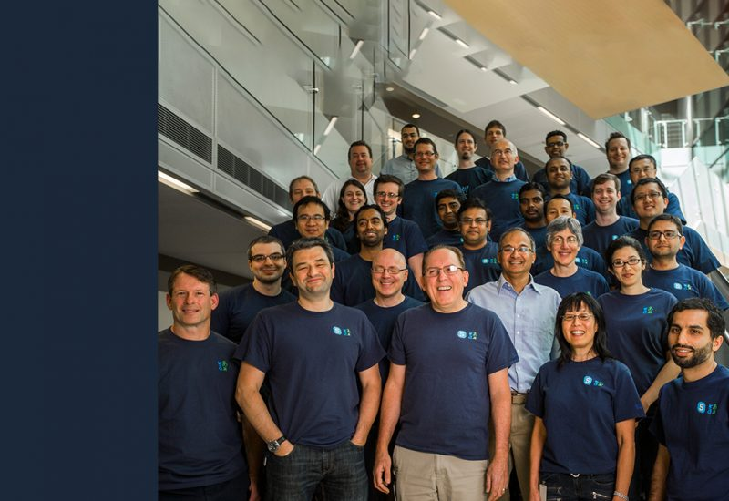

## secret of learning
if you want to learn what you want:
- never give up
- try evry thing
- never stop learning
- etc
- ...
- ..
- .

Guess what?
[this is a link](https://mohammad-osoolian.github.io/gitproject)
line

enter line

enter enter line
line

10*enter line

That man in right down corner was my teacher in iust (Iran university of sciense and technology).
actually he is now but for anyone who reads this post 1 year after 2020-19-11, he was my teacher.

can i tell you a secret?
Actually i'm not very good at english and this post was a test post and a just wrote evry thing i liked i this post and i think there is a lot of mistakes in this post therefor i hope no one reads this post but know that you are reading this post, email me pls. So i know who you are.
Thank you!!!!!!!!!!!!!!!!!! 

---
**Test**: This is b test
